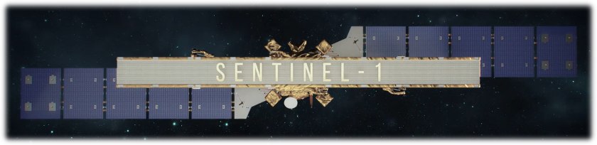

# Sentinel-1 AIS Processor
This repository contains the end-to-end AIS processor developed at ESA–ESTEC for the Copernicus Sentinel-1 C&D mission.

## End-to-end AIS Processor
The script `process_s1_ais_raw.py` performs the end-to-end AIS processing, starting from the AIS Instrument Source Packets (ISPs) to AIS message content. \
Raw AIS data is extracted and demodulated for all frequency channels and polarizations, including linear combinations at ±45 degrees.

### Usage:

Run the main Python script with the following command structure:

```bash
python process_s1_ais_raw.py <input_folder> -o <output_folder>
```
`<input_folder>`: Path to the Sentinel-1 AIS SAFE folder containing the binary `.dat` file.\
`<output_folder>`: Path where the processed output files will be saved.

#### Example test case:
The `/Testcase/` folder contains a simulated AIS dataset in Sentinel-1 ISP format. To run the script on this test data, use:
```bash
python process_s1_ais_raw.py ./Testcase/S1C_AI_RAW__0____20220531T155630_20220531T155744_000016________2D48.SAFE/ -o ./Testcase/output
```
The expected output can be found in the directory `/Testcase/output`. Note: for the specific testcase no detections are expected to be demodulated from the H-V input channel.

### Outputs include:
- Extracted ISP headers and de-interleaved raw data (.wav)
- Decoded AIS messages, named: `S1C_AI_L1_YYYYMMDDTHHMM_YYYYMMDDTHHMM.txt`
- Binary detections from each AIS channel
- Summary report with statistics for each input stream
- List of invalid message detections

## ESA AIS Receiver Subfunction

Demodulation of each AIS channel is based on the ESA-patented algorithm, _Receiving Method And Receiver For Timing And Frequency Offset Correction Of Continuous Phase Demodulation In Satellite-Based Automatic Identification Systems_ (PCT/EP2014/051273).

## Compilation:
The source code implementing the ESA-patented AIS algorithm is located in the directory _/src/ESA_AIS_receiver_code/_ and can be compiled using the `Makefile` by running:
```
make
```
This will generate the _AIS_receiver_ executable used by the Python script. Note: To run the executable within the Sentinel-1 AIS end-to-end processor (_process_s1_ais_raw.py_), the executable must be located in the main directory. The executable is currently only compiled for macOS and Linux. 


## Standalone Execution:
The compiled ESA AIS receiver can also be run independently from the Python script for a single channel as follows:

``` bash
./AIS_receiver <data_len> <outputFile> <inputWavfile>
```

Input parameters are defined as follows:

| Parameter        | Description                                                                                          |
|------------------|----------------------------------------------------------------------------------------------------|
| `<data_len>`     | AIS message bit length: `168` for heritage AIS Channels (162 MHz) or `96` for SAT-AIS Channels (156 MHz) |
| `<outputFile>`   | Output directory and filename (with `.txt` extension) where the AIS detections will be saved            |
| `<inputWavfile>` | Input two-channel WAV file containing the raw IQ AIS data sampled at 28.8 kHz                 |


\
The executable loads the following files which must be present in the main directory before running:
| Filename        | Description                                         |
|-----------------|-----------------------------------------------------|
| `<h1.dat>`     | Low-pass filter coefficients                        |
| `<h2.dat>`     | Matched-filter coefficients                         |
| `<h3.dat>`     | Low-pass filter (zonal) coefficients                |
| `<h4.dat>`     | Low-pass filter coefficients (mod. Meng-Mor. frequency estimation) |
| `<pulse.dat>`  | GMSK pulse coefficients                             |
| `<error_files>` | Directory containing the syndrome error correction files                              |


## Python Dependencies:
The following Python packages are required to run the Sentinel-1 AIS processor:
```
bitarray==2.9.2
numpy==2.3.1
pandas==2.3.0
pyais==2.6.5
scipy==1.16.0
shapely==2.0.4
```
To install all dependencies, run:
```bash
pip install -r requirements.txt
```

## Additional References
[1] G. Colavolpe, T. Foggi, A. Ugolini, J. Lizarraga, S. Cioni, and A. Ginesi, _A highly efficient receiver for satellite-based Automatic Identification System signal detection_, 2014.

## License
Licensed under the Apache License 2.0.
